# Zap AI Assigment - MCP Integration


> **AI-Powered Shopping Assistant**: Transform any MCP-compatible AI into an intelligent e-commerce companion through Anthropic's Model Context Protocol (MCP) Integrated to Zap platform.

## Description

This project shows how AI assistants can connect directly to Zap platform, using the Model Context Protocol (MCP). By implementing both local and remote MCP servers, this integration enables chat-based agents to search product catalogs, compare prices, build shopping carts and generate purchase links through natural-language conversations.


**Core Innovation**: Transform any MCP-compatible AI into an intelligent shopping assistant that can search products, compare prices across sellers, manage shopping carts, and generate payment links - all through conversational AI.

## Demo Logic

The demonstration follows a complete e-commerce user journey:

```mermaid
flowchart TD
    A["🔍 Product Discovery<br/>Natural language search across"] --> B["💰 Price Comparison<br/>Multi-seller analysis"]
    
    B --> C["📦 Stock Verification<br/>Availability checking"]

    C --> D["🛒 Cart Management<br/>Session-based shopping cart<br/>with real-time totals"]

    D --> E["💳 Checkout Flow<br/>Payment link generation<br/>(mock for demo purposes)"]
    
        
    style A fill:#f8f9fa,stroke:#333,stroke-width:2px,color:#000
    style B fill:#f8f9fa,stroke:#333,stroke-width:2px,color:#000
    style C fill:#f8f9fa,stroke:#333,stroke-width:2px,color:#000
    style D fill:#f8f9fa,stroke:#333,stroke-width:2px,color:#000
    style E fill:#f8f9fa,stroke:#333,stroke-width:2px,color:#000
```



**Example Flow**: *"אני צריך מקרר חדש"* → Search → Compare → Add to cart → Checkout - all handled conversationally by Claude through MCP tools.

## Thought Process & Methodology

### Research & Market Analysis
- **Deep Research**: Analyzed MCP adoption trends across AI platforms, with Claude leading implementation
- **Market Focus**: Identified Israeli e-commerce market needs through Zap.co.il structure analysis
- **Category Mapping**: Scraped 634 official categories from Zap.co.il (חשמל ואלקטרוניקה > subcategories) for close to real mock DB.

### Technical Approach
- **Dual Architecture**: Both local (stdio) and remote (HTTP) servers for different use cases
- **Protocol Selection**: MCP chosen for its structured tool calling and it's generally adopted
- **Data Generation**: Script-based mock product creation ensuring category coverage - based on zap web data.
- **Israeli Localization**: NIS pricing, Hebrew categories, local seller names - works great using Hebrew.

### Demo Test

## Using ChatGPT - Custom GPT

- **Hebrew - Consive Tone**
https://chatgpt.com/g/g-688b4875d61c81918746a73da6c90812-zap-mcp-mock/c/688b4d07-914c-832c-b758-8bc9045d29bc

## Using Claude 

- **Hebrew - Consive Tone** - https://claude.ai/share/4b6ff194-b97b-4f6b-899a-761ffe663907
- **Hebrew - None Formal Tone** - https://claude.ai/share/0ab0eda9-80c1-4821-9db2-cc304dbf4cb6
- **English - Consive Tone** - https://claude.ai/share/4aac91d1-0daf-48f4-aada-6903181ea887


## Usage Instructions

### 🚀 Quick Start - Remote Server (Recommended)

#### Option 1: Custom ChatGPT (Quickest)

**Zap MCP Mock GPT** - https://chatgpt.com/g/g-688b4875d61c81918746a73da6c90812-zap-mcp-mock

#### Pre-configured ChatGPT with direct MCP integration - just start chatting!

- No setup required
- Instant access to all MCP tools
- Natural language shopping experience

#### Option 2: Setup in Claude (Recommended)

***NOTICE - for paying subscriptions***

**Ready-to-use MCP endpoint**: `https://zap-mcp-server-remote.onrender.com/mcp`


Use the link and jump to step **4** - https://claude.ai/settings/connectors

1. Open Claude and navigate to *Settings → Connectors*  
2. Switch to **"Organization connectors"** tab
3. Find the **"Connectors"** section 
4. Click **"Add custom connector"**
5. Paste: `https://zap-mcp-server-remote.onrender.com/mcp`
6. Click **"Add"** to complete setup

**Try it**: Ask Claude *"אני צריך מקרר חדש"* and watch the MCP tools in action!

⚠️ **Note**: Render free tier hibernates after 15 minutes of inactivity - first call may fail and will wake the instance.

### Alternative - 🛠️ Local Server Usage Setup

**Prerequisites:**
- Node.js 18+

**Installation:**
```bash
# Install globally
npm install -g zap-mcp-server-home-assigment

## MCP Client Configuration

Add to your MCP client settings:


```

**Claude Configuration for Local Server:**
1. Open Claude Desktop settings
2. Add to MCP servers configuration:
```json
{
  "mcpServers": {
    "zap-mcp-server-home-assigment": {
      "command": "npx",
      "args": ["zap-mcp-server-home-assigment"]
    }
  }
}
```

**Available MCP Tools:**
- `product_search` - Natural language product search with filters
- `get_product_details` - Detailed product specifications
- `compare_prices` - Multi-seller price comparison
- `check_availability` - Real-time stock verification
- `add_to_cart` - Virtual shopping cart management
- `generate_payment_link` - Checkout URL generation


## Project Structure

```
├── README.md                          # Main documentation
├── idea_summary.pdf                   # Project concept
└── project/
    ├── Zap-MCP-Server/               # Local MCP Server (stdio)
    │   ├── build/index.js            # Compiled output
    │   └── data/                     # Product & seller data
    └── Zap-MCP-Server-Remote/        # Remote MCP Server (HTTP)
        ├── index.js                  # Express server
        ├── package.json              # Dependencies
        ├── render.yaml               # Deployment config
        └── data/                     # Product & seller data
```


## Tech Stack

- **Backend**: Node.js, TypeScript, Express
- **MCP**: Anthropic MCP SDK
- **Validation**: Zod schemas
- **Deployment**: Render Platform
- **Data**: JSON-based mock datasets

---

*Built as a proof of concept for AI-driven e-commerce integration using Anthropic's Model Context Protocol.*